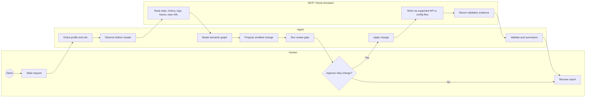
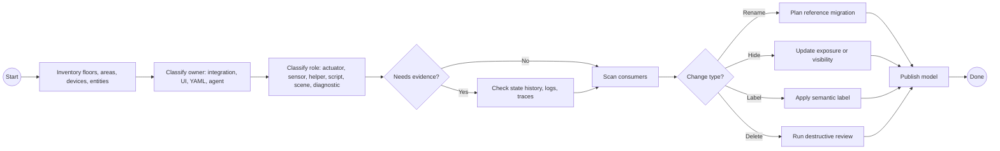
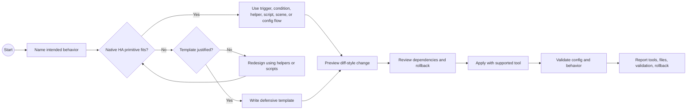
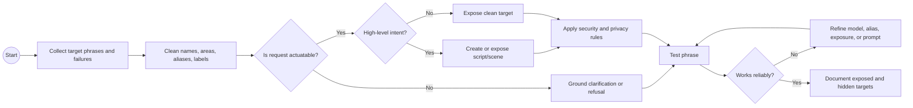
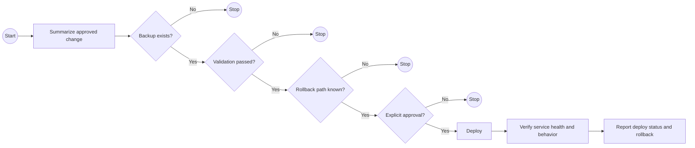

# Teaching Home Assistant MCP

This document is an ontology and curriculum for teaching people how to use MCP-backed agents with Home Assistant in an idiomatic, safe, and maintainable way.

It is based on the marketplace architecture, upstream Home Assistant skills, observed setup failures, real configuration workflows, dashboard design work, voice assistant grounding, entity cleanup, and deployment safety practice.

## Core Thesis

Home Assistant agent work is not "ask an LLM to edit YAML." It is graph work over a living home system.

The agent must learn four graphs at once:

1. The **home graph**: floors, areas, devices, entities, labels, helpers, scripts, scenes, dashboards, voice exposures, and integrations.
2. The **configuration graph**: YAML files, UI-managed config, config entries, registries, storage-mode dashboards, packages, and repo references.
3. The **tool graph**: skills, MCP servers, read tools, write tools, deploy tools, hooks, setup profiles, and client-specific config.
4. The **risk graph**: observation, proposal, mutation, validation, deployment, rollback, privacy, and destructive operations.

Good Home Assistant MCP practice teaches the agent to choose the smallest trustworthy tool that can answer the question, then escalate only when the current layer cannot do the job.

## Ontology

### 1. Agent And Marketplace Layer

| Concept | Meaning | Teaching rule |
|---|---|---|
| Marketplace | Catalog of installable skills, MCP templates, and review gates | Installing a plugin should not connect to Home Assistant by itself. |
| Plugin | A profile-shaped bundle of skills, docs, templates, and optional hooks | Teach plugins as capability envelopes, not permissions. |
| Skill | Local instruction that routes judgment and safety | Load skills before choosing broad live-write tools. |
| MCP server | Runtime tool provider | MCP is a tool boundary, not an agent policy. Skills still govern use. |
| MCP template | Placeholder config stored under `docs/templates/` | Templates must be copied and filled in locally; plugin-root MCP files with placeholders are dangerous. |
| Profile | Least-privilege composition of plugins | Safe Observer, Builder, Power User, Live Deployer, Full Power are escalation levels. |
| Hook | Optional local guardrail | Hooks must be opt-in and fail open unless the host behavior is fully known. |

### 2. Home Assistant Domain Layer

| Concept | Meaning | Teaching rule |
|---|---|---|
| Floor | Broad physical level | Use floors for coarse queries and dashboards, not fine-grained automations. |
| Area | Human room/place model | Most voice, dashboard, and automation grounding should start here. |
| Device | Physical or integration-owned thing | Device identity can be unstable after re-add; avoid anchoring long-lived automations to `device_id` when entity targeting is clearer. |
| Entity | State/control surface | Entity IDs are the primary dependency surface and must be scanned before rename/delete. |
| Label | Semantic cross-cutting set | Use labels for concepts like "light switch" or "voice exposed" instead of broad domain wildcards. |
| Helper | User-visible reusable state or computed primitive | Prefer helpers when state should persist, appear in dashboards, or be edited by humans. |
| Script | Named action sequence | Use scripts for high-level voice commands and dashboard buttons. |
| Scene | Named target state | Use scenes for mode-like states; keep them reviewable. |
| Automation | Event-to-action behavior | Prefer native triggers, conditions, waits, and modes before templates. |
| Dashboard | Human control and observation surface | Design around tasks, rooms, modes, and exceptions; never dump entities. |
| Voice exposure | What Assist/Alexa/LLM can see or control | Expose intentionally; hide diagnostic, security-sensitive, confusing, or non-actuable entities. |
| Config entry | Integration-owned state | Use UI/API/MCP flow tools; do not patch `.storage` directly. |
| Registry | HA's identity layer for entities/devices/areas/labels | Registry edits require dependency scans and rollback awareness. |
| History | Evidence of recent life and behavior | Use history to distinguish dead, idle, unavailable, and intentionally powered-off devices. |

### 3. MCP Capability Layer

| Layer | Primary plugin | Use for | Do not use for |
|---|---|---|---|
| Official context/control | `ha-context-official` | Exposed-state context, Assist-oriented tools, low-risk observation/control | Full config authoring, repo refactors, registry cleanup, dashboard mutation |
| Broad config authoring | `ha-config-ha-mcp` | Search, states, history, automations, scripts, helpers, dashboards, areas, labels, integrations, Assist pipelines, backups/config checks | Unreviewed destructive changes, casual `.storage` edits, silent deploys |
| Repo-first power use | `ha-repo-poweruser` | Local dependency scans, YAML boundaries, reviewable repo work | Assuming live HA state or UI-managed config is represented in repo files |
| Live deployer | `ha-deploy-vibecode` | Approved deployment, rollback, validation, high-privilege HA-side operations | Exploration, casual control, speculative writes |
| Review gates | `ha-review-gates` | Change review, destructive operation review, security review | Replacing human approval or upstream tool policy |

### 4. Risk Layer

| Risk class | Examples | Required behavior |
|---|---|---|
| Read | list/search/state/history/logs/traces/integration info | Safe to use for discovery, but treat household behavior as private. |
| Write | create/edit automation, helper, dashboard, area, label, script, scene | Produce intent and diff-style summary before applying. |
| Refactor | rename entity, move areas, change labels, consolidate groups | Build dependency graph first; inspect live and repo consumers. |
| Destructive | remove/delete/disable registry entry, device, helper, dashboard, file | Explicit approval after dependency scan. |
| Deploy | backup, restore, reload, restart, apply branch | Backup, validation, diff summary, deploy result, rollback path, explicit approval. |
| Sensitive | `.storage`, `secrets.yaml`, tokens, people, locks, alarm, presence | Avoid direct mutation; minimize exposure; document boundaries. |

## Best Practice Axioms

1. **Least powerful tool first.** Start with skills and read tools. Move to write/deploy tools only when the question demands it.
2. **Model the home before changing it.** Areas, floors, labels, helpers, and voice exposures are the semantic substrate.
3. **Prefer native Home Assistant primitives.** Native triggers, conditions, helpers, scripts, scenes, and config flows beat custom Jinja and raw YAML in most cases.
4. **Treat registries and config entries as graphs.** Renames and deletes have consumers outside the obvious YAML files.
5. **History is evidence, not truth.** A smart bulb with no recent state may be dead, or it may be switched off at the wall. Interpret history with domain knowledge.
6. **Do not confuse availability with usefulness.** Hide noisy, diagnostic, duplicate, or non-actuable entities from voice assistants even when they are alive.
7. **Use labels for semantic operations.** A label like `light_switch` is safer than targeting `switch.*` for a shutdown routine.
8. **Represent high-level intent as scripts.** Voice assistants should invoke "good night", "water the lawn", or "movie mode" as named scripts/scenes where possible.
9. **Dashboards are operational surfaces.** Design them around decisions and repeated workflows, not around entity inventory.
10. **MCP setup must be host-neutral.** Codex and Claude Code differ, but the conceptual setup is the same: choose local stdio or remote HTTP, then configure the right host.
11. **Do not auto-start placeholders.** Template MCP configs belong under docs until real URLs/tokens are supplied.
12. **Pin external skill packs.** Direct Git plugin sources make Codex installs reliable; submodules support local/Claude review.
13. **Hooks are not a substitute for policy.** Broken hooks can block all agent work. Keep them opt-in unless host behavior is proven.
14. **Separate observation, authoring, and deployment.** The same agent can do all three, but the human should see the escalation.

## Pedagogical Progression

Teach the material in nine stages. Each stage has a vocabulary target, tool target, exercise, and exit criterion.

| Stage | Learner goal | Skills and tools | Exercise | Exit criterion |
|---|---|---|---|---|
| 1. Boundaries | Understand what each MCP can and cannot do | `ha-marketplace-orientation`, `ha-agent-operating-model`, `docs/mcp-inventory.md` | Explain official MCP vs `ha-mcp` vs deployer | Learner chooses the right profile without enabling Full Power by default. |
| 2. Read-only discovery | Inspect a home without changing it | Official MCP, `ha-mcp` read tools, history/search/state tools | Find areas, devices, exposed entities, and recent activity | Learner can produce an evidence table without writes. |
| 3. Semantic home model | Normalize floors, areas, labels, aliases, and exposures | `ha-semantic-home-model`, `ha-entity-refactor`, `ha-dependency-graph`, `safe-refactoring.md` | Audit ambiguous areas and voice-exposed entities | Learner distinguishes rename, area move, hide, alias, and delete. |
| 4. Helpers and automations | Author maintainable behavior | `ha-automation-author`, `ha-helper-selection`, `automation-patterns.md` | Build a motion-light or mode automation with a helper | Learner selects automation mode and helper type deliberately. |
| 5. Voice grounding | Make Assist/voice reliable | `ha-voice-assist-grounding`, `device-control.md`, `ha-mcp-config-author`, Assist exposure/pipeline tools | Expose a script and hide confusing sensor/device entities | Learner can explain why voice sees fewer entities than HA. |
| 6. Dashboards | Build task-centered interfaces | `ha-lovelace-yaml-dashboard`, `dashboard-guide.md` | Redesign a room or system dashboard from actual device semantics | Learner groups by workflow, mode, exception, and trend. |
| 7. Safe refactoring | Change names and structure without drift | `ha-repo-refactor`, `ha-dependency-graph`, `safe-refactoring.md` | Rename/consolidate a redundant group after consumer scan | Learner checks YAML, dashboards, config entries, registries, and docs. |
| 8. Validation and deployment | Apply approved changes safely | `ha-change-review`, `ha-backup-rollback`, `ha-live-deploy-safety` | Prepare deploy report with rollback path | Learner refuses deploy without validation and rollback. |
| 9. Marketplace maintenance | Keep plugins current and compatible | validation scripts, upstream inventory, Codex/Claude install docs | Refresh reference repos and update material docs only | Learner separates upstream churn from marketplace-impacting change. |

## Operating Loop

Every real task should follow this loop:

```text
Orient -> Observe -> Model -> Propose -> Review -> Apply -> Validate -> Report
```

| Step | Question | Typical action |
|---|---|---|
| Orient | What profile and risk class is this? | Load orientation/tool-policy skills. |
| Observe | What does HA/repo/history say now? | Use read tools and local scans. |
| Model | What semantic object are we changing? | Identify area/device/entity/helper/script/dashboard/config entry. |
| Propose | What will change and why? | Produce plan or diff-style summary. |
| Review | What can break? | Dependency scan, destructive review, security review. |
| Apply | What is the smallest safe write? | Prefer API/config-flow/tool write over raw file mutation. |
| Validate | Did HA accept it and does behavior match? | Config check, state check, history, logs/traces, screenshot where useful. |
| Report | What changed and how do we undo it? | Files/tools used, validation result, deploy state, rollback path. |

## BPMN Workflow Atlas

Use these as teaching diagrams. They are BPMN-style Mermaid workflows with explicit gateways, human approval, agent work, and Home Assistant/MCP evidence.

### Universal Agent Loop



### Semantic Home Model



### Config Authoring



### Voice Grounding



### Live Deployment



## Tool Selection Heuristics

### Official MCP

Use official Home Assistant MCP when the lesson is about exposed context and Assist-style control:

- "What can the assistant see?"
- "What is the current state of an exposed entity?"
- "Can I control this explicitly exposed device?"

Teach its limitation clearly: it is not the configuration-authoring layer.

### ha-mcp

Use `homeassistant-ai/ha-mcp` when the lesson is about Home Assistant as a configured system:

- search and overview
- states, history, logs, traces
- areas, floors, labels, categories
- helpers, scripts, scenes, automations
- dashboards and dashboard screenshots
- integrations and config subentries
- Assist pipelines and voice exposure
- backups, config checks, updates, system tools

Teach risk classification before tool names. A learner should be able to say "this is read", "this is write", or "this is destructive/deploy" before invoking the tool.

### Repo Power User

Use repo tools when the lesson is about reviewable Home Assistant config:

- scan entity references
- inspect agent-managed YAML
- propose layout changes
- avoid UI-managed `automations.yaml`
- keep package/dashboard changes reviewable

Teach that repo state is incomplete for UI-managed integrations and storage-mode dashboards.

### Vibecode Deployer

Use the deployer only after the learner can write a deployment report:

- intended changes
- validation result
- backup identifier
- deploy status
- rollback command or UI path

The deployer is a high-privilege runtime bridge, not a convenience control surface.

## Voice Assistant Teaching Model

Voice work is where the home graph, tool graph, and user language collide.

Teach these as separate decisions:

| Decision | Good pattern |
|---|---|
| Entity exposure | Expose only useful, well-named, low-confusion entities and scripts. |
| Area/floor naming | Use human phrases and aliases; avoid stale integration names. |
| Switch vs light ambiguity | Model physical switch-to-bulb relationships with groups/scripts/labels instead of expecting the LLM to infer hardware topology. |
| High-level commands | Use scripts/scenes for "good night", "water the lawn", "movie mode", and similar intents. |
| Capability boundaries | Prompt/ground the assistant that it cannot add devices or actuate sensors. |
| Live questions | Require live context/history for status questions instead of static guesses. |
| Security-sensitive control | Hide or require confirmation for alarm, locks, doors, and private sensors. |
| LLM model tuning | Keep prompts concise, keep tool/entity exposure intentional, and turn off reasoning modes when they leak into voice UX. |

The core voice lesson: an LLM is better at intent routing when Home Assistant's semantic model is already clean.

## Dashboard Teaching Model

Teach dashboards as decision tools:

1. Identify the job: room control, wall glance, mobile action, system analysis, alarm/security, energy/power.
2. Identify the user posture: walking by, standing at a wall panel, on a phone, debugging at a desk.
3. Group controls by intent, not by integration.
4. Surface exceptions and trends before raw controls.
5. Use history/statistics where thresholds need grounding.
6. Hide dead or always-zero measurements until proven useful.
7. Prefer maintainable built-in cards unless the user asks for custom cards.

The learner should be able to explain why every widget exists.

## Refactoring Teaching Model

Entity and device cleanup is the clearest place to teach graph thinking:

1. Inventory all candidates.
2. Classify them: active, idle, unavailable-but-expected, ghost, duplicate, integration-owned, user-created.
3. Use history and integration knowledge to avoid false positives.
4. Scan consumers before rename/delete.
5. Prefer hiding/renaming/exposure changes before deletion when uncertain.
6. Delete only after explicit approval and when recreation risk is understood.
7. Re-run the audit after changes.

Common lesson: integration-owned objects may come back if renamed in the wrong layer. Fix the source integration naming when that is the real authority.

## Assessment Rubric

A learner is ready for **Safe Observer** when they can:

- explain official MCP boundaries
- inspect exposed context without writing
- report privacy-sensitive observations carefully

A learner is ready for **Builder** when they can:

- classify tool risk
- choose helpers/native primitives before templates
- produce diff-style summaries
- use history/logs/traces for debugging

A learner is ready for **Power User** when they can:

- scan cross-references before entity changes
- distinguish repo-managed YAML from UI/config-entry state
- manage labels, areas, and dashboard references as a graph

A learner is ready for **Live Deployer** when they can:

- produce backup, validation, deploy, and rollback evidence
- recognize destructive operations without being told
- stop when rollback is unknown

## Teaching Anti-Patterns

- Starting with Full Power because it is convenient.
- Teaching MCP setup before explaining host, transport, and authentication boundaries.
- Treating official MCP and `ha-mcp` as interchangeable.
- Teaching YAML snippets before teaching helpers, config flows, and native automation primitives.
- Renaming entities without consumer scans.
- Treating no history as proof of death without checking device class and power topology.
- Exposing every entity to voice assistants.
- Designing dashboards from entity lists.
- Auto-registering hooks or MCP servers with placeholder paths.
- Letting deployment tools become the first debugging tool.

## Canonical Teaching Path

For most users:

```text
Safe Observer -> Builder -> Voice grounding -> Dashboard design -> Refactor -> Deploy
```

For repo-centric users:

```text
Safe Observer -> Repo dependency graph -> Builder -> Review gates -> Deploy
```

For voice-first users:

```text
Safe Observer -> Home semantic cleanup -> Voice exposure -> High-level scripts -> Assist pipeline tuning
```

For marketplace maintainers:

```text
Reference refresh -> Material impact audit -> Manifest validation -> Skill graph update -> Host-specific install check
```

The goal is not to teach every tool. The goal is to teach the judgment that makes tool use boring, reviewable, and reversible.
