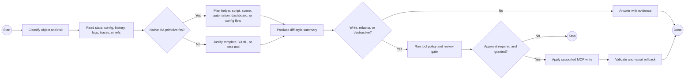

# HA MCP Config Author

## Guidance

- Use ha-mcp for automations, scripts, helpers, dashboards, registry metadata, search, logs, traces, backups, and config checks.
- Classify the target object and risk before choosing a tool.
- Observe live state and existing config before proposing a write.
- Prefer creating new agent-managed artifacts over mutating unclear legacy config.
- Always produce a diff-style summary before applying changes.

## BPMN Workflow

## Safety

- Treat broad write tools as high-risk.
- Do not remove devices, helpers, dashboards, or registry entries without dependency scan and explicit approval.
