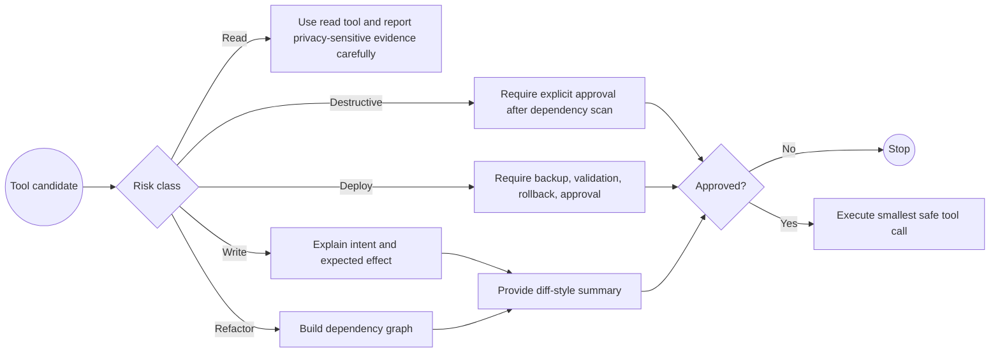

# HA MCP Tool Policy

## Risk Classes

- Read: search, list, logs, traces, history.
- Write: automations, scripts, helpers, dashboards, registry metadata, files.
- Refactor: rename, reassign, relabel, consolidate, migrate, or replace.
- Destructive: delete, remove, disable, overwrite, restore, restart, or reboot.
- Deploy: backups, restore, config check, reload, restart.

## BPMN Workflow

## Safety

- Do not call write or deploy tools without explaining intent and expected effect.
- Do not call delete/remove tools without explicit user approval after dependency scan.
