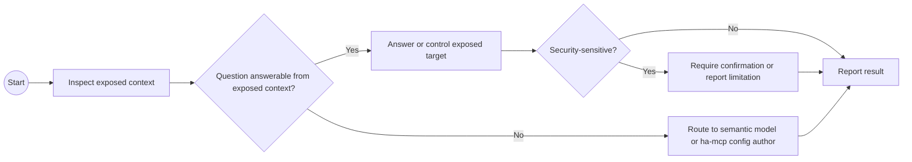

# Official Home Assistant MCP Context

## Good For

- Reading exposed state and context.
- Assist-oriented tools and low-risk control of explicitly exposed entities.
- Checking what a voice/Assist-facing client can see.

## Not Ideal For

- Full configuration authoring.
- Repo refactoring.
- Arbitrary YAML or dashboard mutation.

## BPMN Workflow

## Safety

- Do not assume hidden entities are available.
- Do not use this profile as proof that configuration files are safe to edit.
