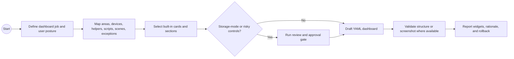

# HA Lovelace YAML Dashboard

## Guidance

- Prefer YAML dashboards for agent-managed dashboards.
- Organize around rooms, people, modes, and exceptions.
- Avoid exotic custom cards unless the user asks for them.
- Start from the semantic home model, not a raw entity dump.
- Use history/statistics only when they inform a decision or threshold.

## BPMN Workflow

## Safety

- Do not mutate storage-mode dashboards without supported tooling and approval.
