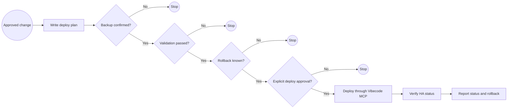

# HA Vibecode Deploy

## Workflow

1. Summarize the approved change.
2. Confirm backup and validation.
3. Request explicit deploy approval.
4. Deploy through the configured MCP only after approval.
5. Report status and rollback path.

## BPMN Workflow

## Safety

- Do not deploy unreviewed changes.
- Do not run destructive operations unless explicitly requested and confirmed.
