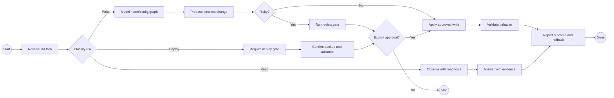

# HA Agent Operating Model

Use this skill when a Home Assistant request spans more than one skill, MCP, or risk boundary.

## Work In This Order

1. Classify the request as observe, author, refactor, deploy, or teach.
2. Identify the target object: area, device, entity, helper, script, scene, automation, dashboard, config entry, registry, file, or deployment.
3. Pick the least-powerful profile and MCP that can answer the question.
4. Observe live state, repo references, history, logs, traces, or docs before proposing a change.
5. Build the semantic model before touching configuration.
6. Propose the smallest change with expected effects.
7. Route risky writes through review gates.
8. Apply only after approval when approval is required.
9. Validate with the right evidence.
10. Report files changed, MCP tools used, validation result, deploy status, and rollback path.

## BPMN Workflow

## Operating Rules

- Prefer skills and read tools before write tools.
- Prefer Home Assistant APIs, config flows, and helpers before raw file edits.
- Prefer semantic labels, scripts, scenes, and helpers over broad domain wildcards.
- Prefer hiding, aliasing, or documenting confusing entities before deleting them.
- Treat history as evidence that needs domain interpretation.
- Treat tool availability as capability, not permission.
- Stop when the rollback path is unknown.

## Safety

- Do not skip dependency scans, review gates, backup checks, or explicit approval because a tool is available.
- Do not collapse observe, author, and deploy into one silent step.
