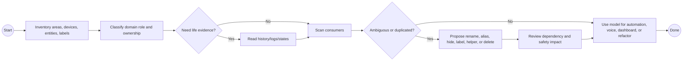

# HA Semantic Home Model

Use this skill before changes that depend on how the home is organized, named, exposed, or understood by humans and agents.

## Model These Layers

1. Floors and areas: use human names, stable aliases, and consistent capitalization.
2. Devices: group sibling entities by physical device and integration authority.
3. Entities: classify each as actuator, sensor, diagnostic, helper, script, scene, automation, or derived state.
4. Labels: use labels for cross-cutting semantics such as light switches, critical loads, voice exposure, or dashboard membership.
5. Helpers: use helpers when state should persist, be reused, or be edited from UI/dashboard.
6. Voice exposure: expose only useful, understandable, safe targets.
7. Dashboards: design around workflows, exceptions, and trends rather than raw entity inventory.
8. Ownership: distinguish integration-owned config entries, UI-managed config, YAML files, and agent-managed artifacts.

## BPMN Workflow

## Operating Rules

- Build the semantic model before changing names, areas, labels, voice exposure, or dashboards.
- Rename all relevant device siblings together when a device identity changes.
- Hide entities from voice when they are diagnostic, duplicate, non-actuable, security-sensitive, or confusing.
- Use aliases for language variance; use renames for canonical identity; use labels for cross-cutting sets.
- Do not infer that an unavailable or quiet device is dead without checking device type, power topology, integration behavior, and recent history.
- Do not edit `.storage` to fix semantic drift; use supported APIs, UI flows, or MCP tools.
