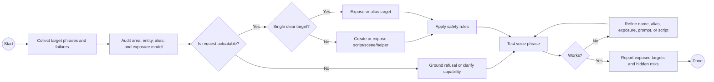

# HA Voice Assist Grounding

Use this skill when configuring Assist, Alexa, or LLM-facing Home Assistant behavior.

## Work In This Order

1. Clean the semantic home model first: floors, areas, device names, entity names, aliases, labels, and helpers.
2. Decide what voice should know, ask, and actuate.
3. Expose high-value actuators, scenes, scripts, helpers, and safe status sensors.
4. Hide noisy diagnostics, duplicate entities, stale integration artifacts, raw power circuits, private sensors, and unsafe controls.
5. Represent high-level intents as scripts or scenes.
6. Add aliases for natural phrases, homophones, and common STT errors.
7. Use live context or history for status questions.
8. Test common phrases and inspect failures as semantic-model defects before blaming the model.

## BPMN Workflow

## Operating Rules

- Prefer named scripts or scenes for intents such as night mode, recurring routines, security checks, media mode, or whole-area control.
- Prefer area and domain targeting only when the area model is clean.
- Never expose every entity to make voice "smarter"; reduce ambiguity instead.
- Do not expose sensors as if they were actuators.
- Confirm or restrict locks, alarms, garage doors, and other security-sensitive controls.
- Teach the assistant what it cannot do: add devices, close a non-actuated door, or repair unavailable hardware through voice.
- Keep prompts concise; move deterministic behavior into HA scripts, scenes, helpers, labels, and exposures.
