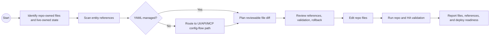

# HA Repo Refactor

## Guidance

- Work in agent-managed files where possible.
- Keep YAML includes obvious and documented.
- Run entity reference scans before moving or renaming entities.
- Treat repo state as incomplete when integrations are UI-managed or storage-backed.

## BPMN Workflow

## Safety

- Do not edit secrets or `.storage`.
- Do not reload or deploy from repo work without validation and approval.
