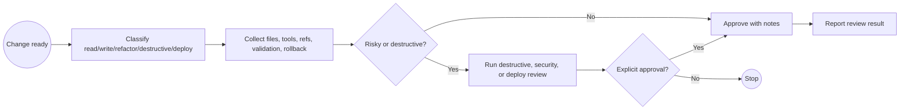

# HA Change Review

## Checklist

- Files changed are listed.
- Entity references were scanned where relevant.
- Validation command is identified.
- Rollback path is documented.

## BPMN Workflow

## Safety

- Do not approve live deploys without backup and validation evidence.
